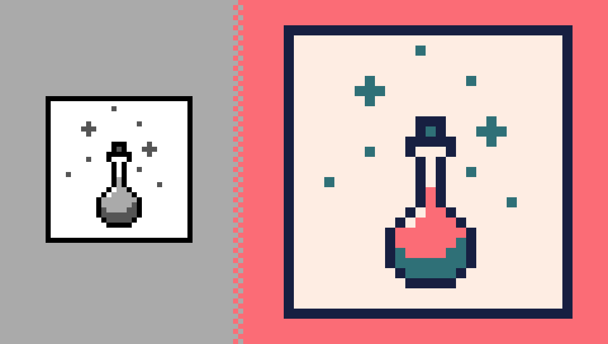

# repixel



Recolor and rescale still and animated pixel art images.

Always upscaled with nearest-neighbor so the pixels stay crisp.

```bash
repixel ~/Desktop/logo.png -p gameboy -x 8
```

scales the input to 8x and recolors it using the `gameboy` palette.

results land in `./out`:


## Install

```bash
brew install dithernaut/tap/repixel
```

That pulls in the three tools repixel shells out to — `ffmpeg`, `imagemagick`
and `webp`.

<details>
<summary>Running from a clone instead</summary>

Install the dependencies yourself:

```bash
brew install ffmpeg imagemagick webp
```

`webp` provides `img2webp` and `cwebp`. Most ffmpeg and ImageMagick builds ship
the WebP *muxer* but no encoder, so WebP output goes through libwebp instead. If
those tools are missing, repixel says so and builds every other format.

Then put the script on your `PATH`:

```bash
ln -s "$PWD/repixel" /usr/local/bin/repixel
```

Symlinks are resolved before `themes.conf` is looked up, so this works.

</details>

The Homebrew formula lives in its own repo,
[dithernaut/homebrew-tap](https://github.com/dithernaut/homebrew-tap).

## Usage

```bash
repixel logo.png                          # preserve colors, rescale and export
repixel logo.png -p gameboy               # one file, one theme/palette
repixel a.png b.gif ~/sprites -p mono     # several inputs at once
repixel ~/Desktop/sprites -p mono         # every image directly in a folder
repixel ~/Desktop/sprites -r -p mono      # ...and everything below it
repixel logo.png -A                       # every theme in themes.conf
repixel logo.png -p 171F41,2F7077,FB6C76,FEEDE3   # one-off colors
repixel logo.png -p lospec:nyx8           # any palette on lospec.com
repixel logo.png -p @nyx8.hex             # a downloaded palette file
pbpaste | repixel logo.png -p -           # a color list copied from anywhere
repixel logo.png -p mono -x 8 -o ~/out    # scale 8x, custom output directory
repixel clip.png -p mono --formats all    # include the ProRes master
repixel clip.png -p mono -c 2,2,100,100   # crop a 98x98 box, then build
repixel clip.png -p mono -s 157           # split at frame 157 -> 2 parts
repixel clip.png -p mono -s 50,120        # split into 3 parts
repixel --list-themes                     # show themes
repixel logo.png --list-colors            # show a source's shades
```

| Option | |
|---|---|
| `-p, --palette PAL` | recolor with a theme name, hex list, `@file`, `-` (stdin) or `lospec:slug`; omit to preserve source colors |
| `-A, --all-themes` | build every theme in the theme file |
| `--fit MODE` | how a palette adapts to a source's shade count: `auto` (default), `nearest`, `ramp`, `exact` |
| `--mix SPACE` | space in-between colors are blended in: `oklab` (default), `oklch`, `srgb`, `linear` |
| `--sort MODE` | reorder a palette darkest → lightest: `auto` (default, imports only), `lum`, `none` |
| `-o, --out DIR` | output directory (default `./out`, relative to the current directory) |
| `-r, --recursive` | recurse into directory inputs |
| `-c, --crop BOX` | `XSTART,YSTART,XEND,YEND`, applied before everything else |
| `-s, --split FRAMES` | comma-separated frame(s) to cut each clip at |
| `-x, --scale N` | integer upscale factor, or `auto` (default) |
| `--max-dim N` | ceiling for `auto` scale, long edge (default 2560) |
| `-f, --fps N` | frames per second (default 12) |
| `--formats LIST` | any of `mov,mp4,apng,webp`, or `all` (default `apng,webp,mp4`) |
| `--max-shades N` | refuse a source with more than N shades (default 64) |
| `--themes FILE` | use a different theme file |
| `--reextract` | force re-extraction of source frames |

### Output goes to `./out`, wherever you are

`-o` defaults to `./out`. `repixel ~/Desktop/logo.png -p mono` writes into
`$PWD/out`. A batch gathered from several places therefore lands in one predictable spot. 

### Inputs

Pass **files**, **directories**, or a mix. A directory contributes the
`.png` / `.apng` / `.gif` / `.webp` files directly inside it; add `-r` to walk
the whole tree. Files you name explicitly are never filtered by extension — if
you point at it, you meant it. Anything already inside the output directory is
skipped, so re-running `repixel . -r` in a folder you've built into won't feed
the results back in.

Two inputs with the same basename would share one output folder; repixel warns
when that happens.

### Stills vs animations

repixel detects this from the file — you don't pass a flag.

- **Animated** input (APNG, GIF, animated WebP) → MP4, APNG, WebP
- **Single-frame** input (an ordinary PNG) → PNG and WebP stills.

Everything else — recoloring, cropping, nearest-neighbor upscaling, theme
matching — is identical either way.

### Palettes

Use `-p` with a theme, color list, file, stdin, or Lospec palette. If you use it
more than once, the last value wins.

| Value | Source |
|---|---|
| `dithernaut-alt` | Theme from `themes.conf`. |
| `171F41,2F7077,…` | Colors from darkest to lightest. Use commas, spaces, or newlines. |
| `#000,#555,#aaa,#fff` | CSS shorthand. This example matches `mono`. |
| `@nyx8.hex` | Palette file. Supports `.hex`, `.gpl`, `.txt`, `.json`, and plain text. |
| `-` | Stdin. Example: `pbpaste \| repixel logo.png -p -` |
| `lospec:nyx8` | Cached [Lospec](https://lospec.com/palette-list) palette. Full URLs also work. |

Theme names take priority. Invalid palettes return an error.

**Color forms**

- Full hex: `RRGGBB`, `#RRGGBB`, or `0xRRGGBB`.
- CSS shorthand: `#RGB` or `#RGBA`. Each digit is doubled; alpha is dropped.
  Example: `-p "#000,#555,#aaa,#fff"` is `mono`.
- Eight digits: `#RRGGBBAA` means CSS (alpha last); bare `AARRGGBB` means
  Paint.NET `.txt` (alpha first).
- Alpha is always dropped, never applied. Repixel recolors opaque flat art.
- In files, shorthand requires `#`: use `#300`, not `300`.
- In typed lists, bare shorthand is accepted: `000` is valid.

Output directories: named themes use `<out>/<source>/<theme>/`; Lospec palettes
and palette files use their own name; typed lists use `custom/`.

Imported palettes are sorted darkest → lightest. Use `--sort none` to preserve original order.

### Fitting palettes to shade counts

`--fit` handles palettes with any number of colors:

| Palette | Result |
|---|---|
| Same size | Uses each color as given. |
| Larger | Selects the nearest palette colors. |
| Smaller | Keeps every color and mixes the missing shades. |

You can change this behavior:

- `--fit nearest` uses palette colors only. Some shades may share a color.
- `--fit ramp` samples the full gradient. It may skip palette colors.
- `--fit exact` skips sources whose shade count does not match.

`--max-shades` rejects sources with too many colors. Its default is 64.

### Mixing new shades

`--mix` controls how new shades are mixed. It only applies when the palette is
smaller than the source shade count.

| Value | Result |
|---|---|
| `oklab` | Default. Produces balanced perceptual steps. |
| `oklch` | Keeps more color between similar hues. Distant hues may shift. |
| `srgb` | Mixes hex values directly. Good for classic color ramps. |
| `linear` | Uses linear light. Produces brighter midtones. |

Example for four shades from black to white:

| `--mix` | Result |
|---|---|
| `oklab` | `000000 363636 949494 FFFFFF` |
| `srgb` | `000000 555555 AAAAAA FFFFFF` |
| `linear` | `000000 9C9C9C D5D5D5 FFFFFF` |

### Cropping

`-c XSTART,YSTART,XEND,YEND` crops the source frame. Bounds are **half-open** (XEND/YEND exclusive), so
`-c 2,2,100,100` gives a **98×98** box at offset 2,2.

A crop that doesn't fit is a hard error when you named a single source.

Cropping makes odd dimensions likely; H.264 needs even ones, so an odd result skips the `.mp4` with a note rather than distorting the art

### Splitting

`-s FRAME[,FRAME...]` cuts each clip at those exact frames. `-s 157` → part 1 =
frames 1–157, part 2 = 158–end; `-s 50,120` → 3 parts. Parts are written as
`..._partN.<ext>`.

## Output

Files land in `<out>/<source>/<theme>/`, e.g.
`out/font-scaling/dithernaut/font-scaling_dithernaut_2032x1200_prores.mov`.

| File | What |
|---|---|
| `..._<WxH>_prores.mov` | ProRes 4444, upscaled — for Final Cut (animations only) |
| `..._<WxH>.mp4` | H.264 preview, upscaled (animations only) |
| `..._1x.png` | native resolution — APNG if animated, PNG if still |
| `..._<S>x.png` | same at the `--scale` factor (skipped when scale is 1) |
| `..._1x.webp` | native resolution WebP |
| `..._<S>x.webp` | WebP at the `--scale` factor |

### Formats

Default formats are `apng,webp,mp4`.

- `--formats mov` creates ProRes for video editing.
- `--formats all` creates every format.
- `png` is accepted as an alias for `apng`.
- Invalid format names return an error.

ProRes takes the most time and disk space. It is not created by default.

### Scale

`-x` defaults to `auto`. It uses up to 16x without exceeding `--max-dim`. The
default maximum dimension is 2560 pixels.

Use `-x N` to set an exact scale.

PNG, APNG, and WebP outputs are lossless. WebP files are usually smaller. For
web use, serve the 1x file and scale it with CSS:

```css
img { image-rendering: pixelated; width: 100%; }
```

Use the `<S>x` files when the target cannot apply nearest-neighbor scaling.

## Themes

Themes live in [`themes.conf`](themes.conf), one per line, colors listed
**darkest → lightest** (they map positionally onto the source's shades):

```
dithernaut = 171F41, 2F7077, FB6C76, FEEDE3
mono       = 000000, 555555, AAAAAA, FFFFFF
grayscale  = 000000, FFFFFF
```

Separators are free-form — commas, spaces, or both — and `#` is optional, so a
list copied from somewhere else can be pasted in as-is.

Add a theme by copying a line and changing the name + colors. The count does
**not** have to match the source's shade count — see
[Fitting](#fitting-palettes-and-shade-counts-dont-have-to-match). 

Run`repixel <file> --list-colors` to see a source's shades.

Without `--themes FILE`, the first of these that exists wins:

## Provide `your own themes.conf` file

With every prompt you can also pass `--themes FILE` to specify a custom themes file. However, you can also permanently set your own themes file by creating `~/.config/repixel/themes.conf`.

The theme file is searched for in the following order:

1. `~/.config/repixel/themes.conf` — your own themes
2. `themes.conf` beside the script — a git checkout run in place
3. `../share/repixel/themes.conf` — an installed copy (Homebrew's `pkgshare`)

`--list-themes` prints which file it's using. If you install repixel through a
package manager, keep your themes in **(1)**: the installed copy is replaced on
every upgrade.

## How it works

1. Extracts the source to frames, cached in `~/.cache/repixel` (keyed by full
   path, and re-extracted automatically when the file changes).
2. Crops them, if `--crop` was given.
3. Detects the source's flat colors, sorted darkest → lightest.
4. Maps each shade to the theme color at the same position, via a sentinel
   color so overlapping source/target values can't collide.
5. Upscales ×`SCALE` with nearest-neighbor and encodes each requested format.

Steps 4 and 5 are pixel-exact: sources are promoted to sRGB TrueColor before
any fill (grayscale sources would otherwise collapse every fill to its gray
value), frames are converted to RGBA before scaling (swscale rounds pal8→RGB
by ±1, which would shift theme colors), and integer nearest-neighbor scaling
replicates pixels rather than resampling. Theme colors come out bit-exact.

## Repository layout

```
repixel                 # the script — put it on your PATH
themes.conf             # named color themes (edit me)
test/run.sh             # the test suite
```

The frame cache lives in `~/.cache/repixel` and is
safe to delete at any time.

## Development

```bash
test/run.sh             # generate fixtures, run every check, clean up
test/run.sh --keep      # leave the built output in test/work/ to look at
```

The suite generates its own fixtures rather than committing binaries: flat
images with an exactly known number of shades (2, 4, 6), an oversized source,
a 256-step gradient, and a small animation. That's the point — nearly every
assertion is about repixel reproducing **specific hex values bit-exactly**, so
the inputs have to be exact too. It covers palette fitting in every shape,
optional `-p`, format and scale selection, the `--max-shades` guard,
cropping, splitting, and the argument validation.

`--keep` is the quickest way to eyeball a change: it leaves real recolored
output in `test/work/` without touching `src/` or `out/`.
